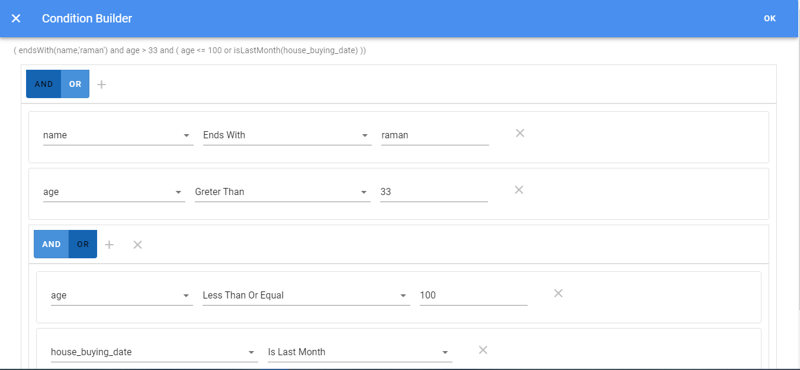

# vuetify-query-builder
### Sample example of a condition builder in vuetify

>Take it as a reference for making your own ,you can use https://www.npmjs.com/package/expr-eval for executing the conditions





## Project setup
```
npm install
```

### Compiles and hot-reloads for development
```
npm run serve
```

### Compiles and minifies for production
```
npm run build
```

### Run your unit tests
```
npm run test:unit
```

### Lints and fixes files
```
npm run lint
```

### Customize configuration
See [Configuration Reference](https://cli.vuejs.org/config/).
